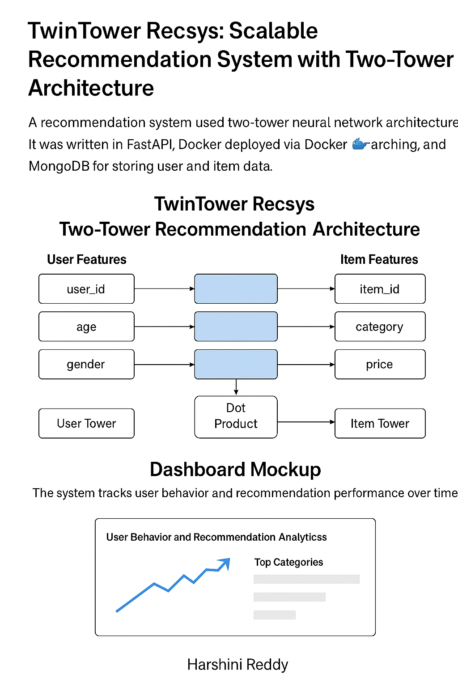
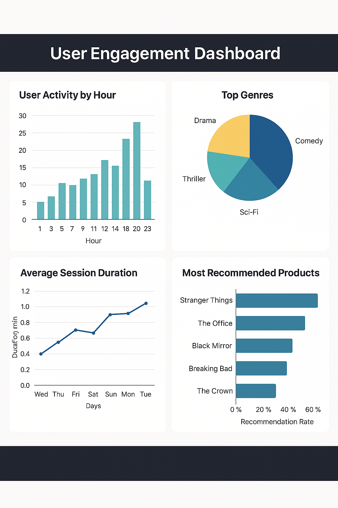

# 🧠 TwinTower Recsys: Scalable Recommendation System with Two-Tower Architecture

TwinTower Recsys is a scalable deep learning-based recommendation system built using the Two-Tower architecture. Designed for large-scale applications like e-commerce or streaming services, it uses separate neural networks to learn embeddings for users and items, enabling fast candidate retrieval and personalization.




## 📌 Project Overview

This system implements a TensorFlow Recommenders-based Two-Tower model where:
- The **user tower** learns embedding representations of users based on historical data.
- The **item tower** maps product/item features to dense vectors.
- The system performs **dot-product retrieval** and uses **approximate nearest neighbor** search for scalable inference.

## 🚀 Tech Stack

- TensorFlow Recommenders
- TensorFlow / Keras
- Python
- Jupyter Notebooks
- Pandas / NumPy / Matplotlib

## 🧠 Use Case

Imagine you're building a recommendation engine for a movie or fashion website. With millions of users and products, this model efficiently retrieves personalized results using learned embeddings rather than computing scores for every product.

## 📁 Project Structure

```
twin-tower-recsys/
├── candidate_tower.py
├── query_tower.py
├── two_tower_model.py
├── data_prep.py
├── train_test_split.py
├── main.py
├── graphs/
├── docs/assets/
│   ├── architecture_diagram.png
│   └── dashboard_mockup.png
```

## 👤 Maintained by
**[Harshini Pothireddy](https://github.com/harshini1708)**  
M.S. in Software Engineering, Data Science Specialization  
San Jose State University

---

> 📌 Add your own dataset or connect this model to a streaming product catalog to make it production-ready!
